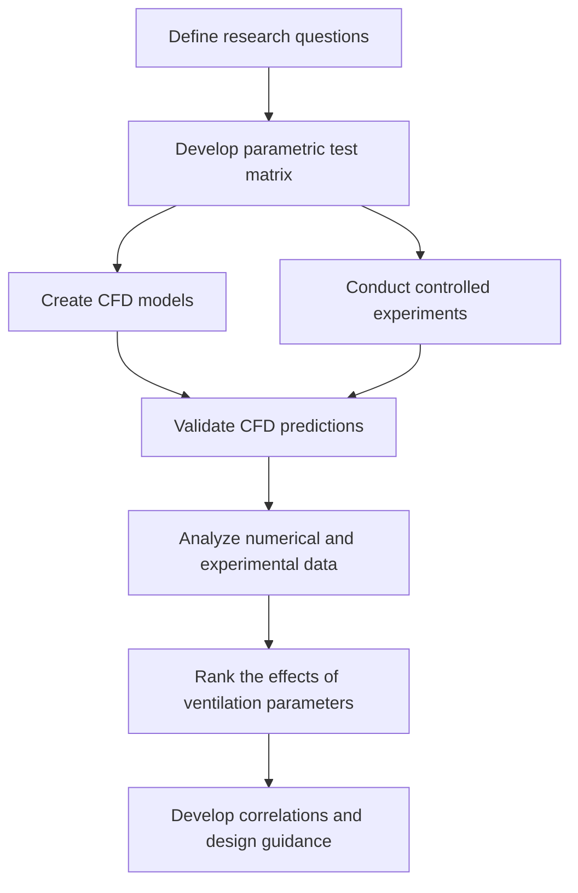

# Ventilation-Performance-of-Indoor-Air-Spaces
CFD and experimental investigation of indoor ventilation performance, focusing on the effects of air change rate (ACR), airflow patterns, diffuser and return configurations, room size, and supply air temperature. 
## Project Overview

This project investigates the relative effects of **Air Change Rate (ACR)** and **indoor airflow patterns** on the ventilation performance of occupied spaces. Conventional ventilation guidelines and airborne-contaminant models often assume that room air is perfectly mixed. In real indoor environments, however, airflow can be highly nonuniform because of HVAC configuration, room geometry, thermal conditions, and contaminant-source location.

The project combines **Computational Fluid Dynamics (CFD)**, controlled experiments, and data analysis to determine whether ventilation performance depends primarily on the quantity of supplied air or also on how effectively that air is distributed throughout a room. The ultimate goal is to identify ventilation strategies that improve indoor air quality and contaminant removal while minimizing energy consumption.

## Objectives

* Quantify the effect of **ACR** on contaminant transport and removal.
* Evaluate how **indoor airflow patterns** influence ventilation effectiveness.
* Investigate the number, location, and type of **supply-air diffusers**.
* Assess the effects of the location and size of **return-air openings**.
* Examine the influence of **room geometry and room size**.
* Study the effects of **supply-air temperature** and indoor thermal conditions.
* Conduct controlled experiments under selected ventilation conditions.
* Quantify the relative importance of ACR and HVAC configuration.

## Methodology

The methodology consists of the following stages:

1. **Research Planning:** Identify the ventilation parameters and operating conditions to be investigated.

2. **Test-Matrix Development:** Select combinations of ACR, diffuser configuration, return-air arrangement, room geometry, supply temperature, heat sources, and contaminant conditions.

3. **CFD Modeling:** Develop numerical room models to predict velocity fields, airflow circulation, contaminant transport, and ventilation performance.

4. **Controlled Experiments:** Measure airflow and ventilation behavior for selected cases from the test matrix.

5. **Model Validation:** Compare CFD predictions with experimental measurements to evaluate numerical accuracy and reliability.

6. **Comparative Analysis:** Analyze the validated data to determine the relative effects of ACR, HVAC configuration, and other operating parameters.

7. **Correlation Development:** Establish relationships among ACR, airflow distribution, HVAC layout, and ventilation performance.

8. **Design Recommendations:** Identify ventilation strategies that provide effective contaminant removal and indoor air quality with reduced energy use.

## Project Description

A higher Air Change Rate introduces more fresh air into a room, but it does not necessarily guarantee effective ventilation throughout the entire occupied space. Poor diffuser placement, unfavorable return-air location, thermal stratification, or recirculation zones may create regions where contaminants remain trapped even when the overall ventilation rate is high.

This project evaluates ACR together with airflow-distribution parameters instead of treating ventilation rate as the only indicator of performance. CFD simulations are used to visualize airflow structures and predict contaminant movement under different HVAC configurations. Controlled experiments provide physical measurements for validating the numerical models.

After validation, the numerical and experimental results are compared to determine which design parameters have the greatest influence on ventilation effectiveness. The resulting correlations and design guidance can support the development of HVAC systems that deliver air more efficiently, improve contaminant removal, and reduce unnecessary energy consumption.

## Key Research Question

> **Is effective indoor ventilation determined only by how much air is supplied, or does it depend equally—or more strongly—on how that air is distributed throughout the room?**

## Expected Outcomes

* Experimentally validated CFD models of indoor airflow and contaminant transport.
* Quantitative comparison of ACR and HVAC-layout effects.
* Identification of ineffective airflow regions and contaminant accumulation zones.
* Ranking of the most influential ventilation-design parameters.
* Correlations between ACR, airflow configuration, and ventilation performance.
* Recommendations for improving indoor air quality while limiting HVAC energy consumption.
