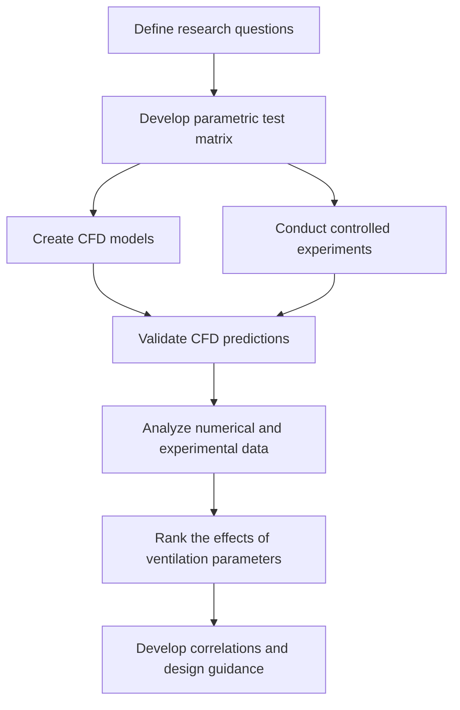

# Ventilation-Performance-of-Indoor-Air-Spaces
CFD and experimental investigation of indoor ventilation performance, focusing on the effects of air change rate (ACR), airflow patterns, diffuser and return configurations, room size, and supply air temperature. 
## Project Overview

This project investigates the relative effects of **Air Change Rate (ACR)** and **indoor airflow patterns** on the ventilation performance of occupied spaces. Conventional ventilation guidelines and airborne-contaminant models often assume that room air is perfectly mixed. In real indoor environments, however, airflow can be highly nonuniform because of HVAC configuration, room geometry, thermal conditions, and contaminant-source location.

The project combines **Computational Fluid Dynamics (CFD)**, controlled experiments, and data analysis to determine whether ventilation performance depends primarily on the quantity of supplied air or also on how effectively that air is distributed throughout a room. The ultimate goal is to identify ventilation strategies that improve indoor air quality and contaminant removal while minimizing energy consumption.

## Objectives

* Quantify the effect of **ACR** on contaminant transport and removal.
* Evaluate how **indoor airflow patterns** influence ventilation effectiveness.
* Investigate the number, location, and type of **supply-air diffusers**.
* Assess the effects of the location and size of **return-air openings**.
* Examine the influence of **room geometry and room size**.
* Study the effects of **supply-air temperature** and indoor thermal conditions.
* Conduct controlled experiments under selected ventilation conditions.
* Quantify the relative importance of ACR and HVAC configuration.

## Methodology

## Project Description

A higher Air Change Rate introduces more fresh air into a room, but it does not necessarily guarantee effective ventilation throughout the entire occupied space. Poor diffuser placement, unfavorable return-air location, thermal stratification, or recirculation zones may create regions where contaminants remain trapped even when the overall ventilation rate is high.

This project evaluates ACR together with airflow-distribution parameters instead of treating ventilation rate as the only indicator of performance. CFD simulations are used to visualize airflow structures and predict contaminant movement under different HVAC configurations. Controlled experiments provide physical measurements for validating the numerical models.

After validation, the numerical and experimental results are compared to determine which design parameters have the greatest influence on ventilation effectiveness. The resulting correlations and design guidance can support the development of HVAC systems that deliver air more efficiently, improve contaminant removal, and reduce unnecessary energy consumption.

## Key Research Question

> **Is effective indoor ventilation determined only by how much air is supplied, or does it depend equally—or more strongly—on how that air is distributed throughout the room?**

## Simulation 

* Simulation of different diffuser types such as square cone, perforated laminar in different supply temperature.
* Simulation of isothermal and non-isothermal conditions.
* Comparison of diffuser throw with manufacturer's data

## Experiment

* Set up experimental chamber and build the duct connections
* Design and 3d print honeycomb for using as flow straightener.
* Measure temperature, velocity and air flow rate in the required locations.
* Experimentally validate CFD models of indoor airflow and contaminant transport.
* Carry out smoke tests and use lasers for visualization of airflow pattern.
  

## Smoke test and visualization

https://github.com/user-attachments/assets/b7a14f5f-150d-4328-bc7e-25872fa7a435

https://github.com/user-attachments/assets/594e0417-d7b3-462c-9eac-355f4efa4f1f

